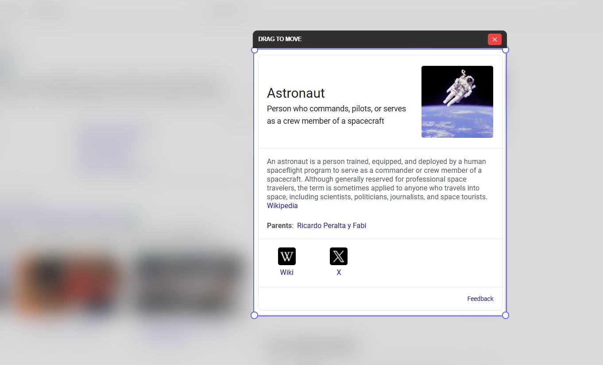

# 🛡️ Adaptive Blur Shield Pro v2.1

A professional-grade privacy extension for Chrome that provides real-time, intelligent content blurring. Protect your sensitive data on WhatsApp, Instagram, and any web platform with custom focus zones.

## 🌟 Key Features
* **Intelligent Auto-Blur:** Automatically hides WhatsApp and Instagram chat previews and message contents until you hover over them.
* **Custom Focus Zones:** Drag and resize a clear "view window" over any part of the screen while blurring everything else.
* **Full Page Stealth:** Instant one-click blur for the entire active tab.
* **Adjustable Intensity:** Precision slider to control blur strength from 5px to 50px.
* **Context Menu Integration:** Right-click anywhere to quickly activate the Shield.

## 🚀 Installation (How to use the ZIP)
1.  **Download** the `AdaptiveBlurShieldPro_v2.1.zip` from the [Releases](#) section.
2.  **Extract** the contents to a folder on your computer.
3.  Open Google Chrome and navigate to `chrome://extensions/`.
4.  Enable **Developer Mode** (toggle in the top right corner).
5.  Click **Load unpacked** and select the folder where you extracted the files.

## 🛠️ Technical Stack
* **Manifest V3:** Built using the latest Chrome Extension standards.
* **Vanilla JavaScript:** Lightweight and high-performance DOM manipulation.
* **CSS3 Clip-Path:** Advanced polygon masking for the "Focus Zone" feature.
* **Chrome Storage API:** Persistent user preferences for intensity and automation toggles.

## 📸 Screenshots
| Manual Focus Zone | Auto-Chat Stealth Mode |
|---|---|
|  |  |

---
*Developed as a Privacy & Security project by a 2nd Year Engineering Student.*
